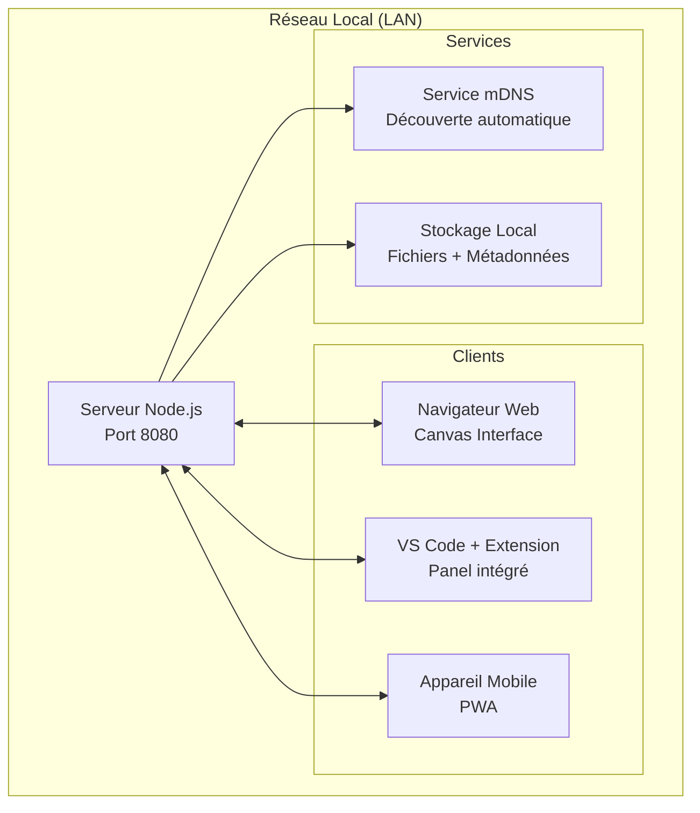

# Design Document

## Overview

Le Local Collaborative Workspace est un système distribué qui fonctionne entièrement sur le réseau local, composé d'un serveur Node.js léger, d'une interface web responsive, et d'une extension VS Code. Le système utilise WebSocket pour la synchronisation temps réel et mDNS pour la découverte automatique des pairs.

## Architecture

### Architecture Générale



### Architecture Technique

- **Serveur Central**: Node.js avec Express et Socket.io
- **Communication**: WebSocket bidirectionnel pour temps réel
- **Stockage**: Système de fichiers local + base SQLite pour métadonnées
- **Découverte**: mDNS (Avahi sur Linux, Bonjour sur macOS/Windows)
- **Interface**: React avec Canvas HTML5 et drag-and-drop natif

## Components and Interfaces

### 1. Serveur Local (Node.js)

**Responsabilités:**
- Gestion des connexions WebSocket
- Stockage et synchronisation des données
- Service de fichiers statiques
- Découverte réseau via mDNS
- API REST pour les opérations CRUD

**Interfaces principales:**
```typescript
interface ServerConfig {
  port: number;
  host: string;
  storagePath: string;
  maxFileSize: number;
}

interface WebSocketEvents {
  'canvas-update': (data: CanvasElement) => void;
  'clipboard-sync': (content: ClipboardData) => void;
  'file-upload': (file: FileMetadata) => void;
  'user-cursor': (position: CursorPosition) => void;
}
```

### 2. Interface Canvas Web

**Responsabilités:**
- Rendu du canvas interactif
- Gestion drag-and-drop
- Synchronisation temps réel via WebSocket
- Interface responsive pour mobile

**Composants principaux:**
- `CanvasContainer`: Conteneur principal avec zoom/pan
- `ElementRenderer`: Rendu des différents types d'éléments
- `DragDropHandler`: Gestion des interactions drag-and-drop
- `RealtimeSync`: Gestionnaire de synchronisation WebSocket

### 3. Extension VS Code

**Responsabilités:**
- Intégration dans l'interface VS Code
- Synchronisation avec le serveur local
- Transfert de fichiers projet ↔ canvas

**Structure:**
```
vscode-extension/
├── src/
│   ├── extension.ts          # Point d'entrée
│   ├── webview/             # Interface intégrée
│   └── services/            # Communication serveur
├── media/                   # Assets statiques
└── package.json            # Manifest extension
```

### 4. Service de Découverte mDNS

**Responsabilités:**
- Publication du service sur le réseau local
- Découverte automatique des instances
- Gestion des connexions multi-instances

## Data Models

### Canvas Element
```typescript
interface CanvasElement {
  id: string;
  type: 'file' | 'note' | 'folder' | 'image';
  position: { x: number; y: number };
  size: { width: number; height: number };
  content: string | FileReference;
  metadata: {
    createdAt: Date;
    updatedAt: Date;
    createdBy: string;
  };
  style: {
    backgroundColor?: string;
    borderColor?: string;
    fontSize?: number;
  };
}
```

### File Reference
```typescript
interface FileReference {
  filename: string;
  originalPath: string;
  storedPath: string;
  mimeType: string;
  size: number;
  checksum: string;
}
```

### Clipboard Data
```typescript
interface ClipboardData {
  id: string;
  content: string;
  type: 'text' | 'html' | 'image';
  timestamp: Date;
  deviceId: string;
}
```

### User Session
```typescript
interface UserSession {
  id: string;
  deviceName: string;
  ipAddress: string;
  userAgent: string;
  connectedAt: Date;
  cursor?: CursorPosition;
}
```

## Error Handling

### Stratégies de Gestion d'Erreurs

1. **Connexion WebSocket**
   - Reconnexion automatique avec backoff exponentiel
   - Queue des messages pendant la déconnexion
   - Synchronisation complète lors de la reconnexion

2. **Transfert de Fichiers**
   - Validation de taille avant upload
   - Vérification d'intégrité via checksum
   - Reprise de transfert en cas d'interruption

3. **Conflits de Synchronisation**
   - Résolution basée sur timestamp (last-write-wins)
   - Versioning des éléments critiques
   - Notification des conflits à l'utilisateur

4. **Stockage Local**
   - Sauvegarde automatique toutes les 30 secondes
   - Backup des données critiques
   - Récupération en cas de corruption

### Codes d'Erreur
```typescript
enum ErrorCodes {
  NETWORK_DISCONNECTED = 'NET_001',
  FILE_TOO_LARGE = 'FILE_001',
  STORAGE_FULL = 'STORAGE_001',
  SYNC_CONFLICT = 'SYNC_001',
  PERMISSION_DENIED = 'AUTH_001'
}
```

## Testing Strategy

### Tests Unitaires
- **Serveur**: Tests des API REST et gestionnaires WebSocket
- **Client**: Tests des composants React et logique métier
- **Extension**: Tests des commandes VS Code et communication

### Tests d'Intégration
- Communication WebSocket bidirectionnelle
- Synchronisation multi-clients
- Transfert et intégrité des fichiers
- Découverte mDNS

### Tests End-to-End
- Scénarios utilisateur complets
- Tests multi-appareils simulés
- Performance avec charge (10+ clients simultanés)

### Environnements de Test
```typescript
interface TestEnvironment {
  serverPort: number;
  clientCount: number;
  networkLatency: number;
  fileSystemPath: string;
}
```

## Performance et Scalabilité

### Optimisations Prévues
- **Canvas**: Virtualisation pour grandes quantités d'éléments
- **WebSocket**: Throttling des mises à jour (60fps max)
- **Fichiers**: Streaming pour gros fichiers, cache intelligent
- **Mémoire**: Garbage collection proactive, limite de sessions

### Métriques de Performance
- Latence de synchronisation < 100ms
- Support jusqu'à 20 clients simultanés
- Fichiers jusqu'à 1GB
- Canvas avec 1000+ éléments fluide

## Sécurité

### Mesures de Sécurité
- **Réseau**: Limitation au réseau local uniquement
- **Fichiers**: Validation des types MIME, scan antivirus optionnel
- **Accès**: Authentification par token de session simple
- **Données**: Chiffrement optionnel des fichiers sensibles

## Déploiement

### Distribution
- **Serveur**: Binaire standalone (pkg/nexe) pour chaque plateforme
- **Extension**: Publication sur VS Code Marketplace
- **Web**: PWA avec service worker pour fonctionnement offline

### Configuration
```json
{
  "server": {
    "port": 8080,
    "host": "0.0.0.0",
    "storagePath": "./workspace-data",
    "maxFileSize": "1GB",
    "enableMDNS": true
  },
  "canvas": {
    "maxElements": 1000,
    "autoSave": true,
    "saveInterval": 30000
  },
  "sync": {
    "clipboardEnabled": true,
    "clipboardHistorySize": 10,
    "maxLatency": 100
  }
}
```