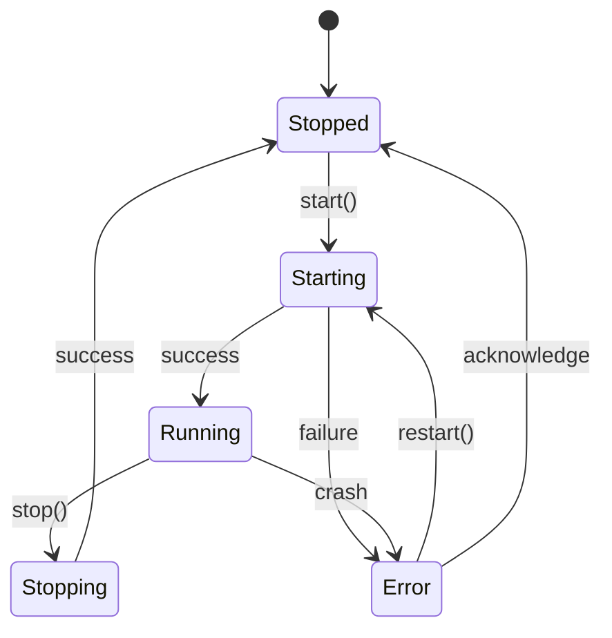
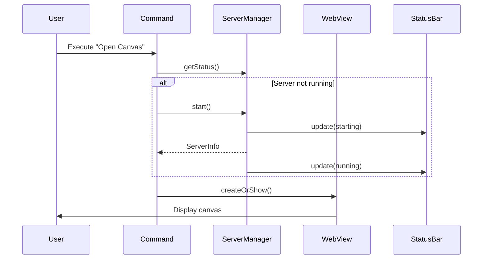
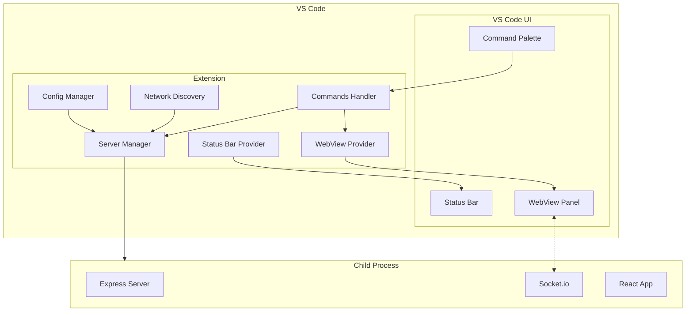

# Design Document: VS Code Extension for Local Collaborative Workspace

## Overview

Cette extension VS Code intègre l'application Local Collaborative Workspace directement dans l'éditeur. Elle gère le cycle de vie du serveur, affiche l'interface dans un WebView, et facilite le partage avec les appareils du réseau local.

## Architecture

```
┌─────────────────────────────────────────────────────────────────┐
│                        VS Code Extension                         │
├─────────────────────────────────────────────────────────────────┤
│  ┌──────────────┐  ┌──────────────┐  ┌──────────────────────┐  │
│  │   Commands   │  │  Status Bar  │  │   Configuration      │  │
│  │   Handler    │  │   Provider   │  │   Manager            │  │
│  └──────┬───────┘  └──────┬───────┘  └──────────┬───────────┘  │
│         │                 │                      │              │
│         └─────────────────┼──────────────────────┘              │
│                           │                                     │
│                    ┌──────▼───────┐                            │
│                    │   Extension  │                            │
│                    │   Context    │                            │
│                    └──────┬───────┘                            │
│                           │                                     │
│         ┌─────────────────┼─────────────────┐                  │
│         │                 │                 │                  │
│  ┌──────▼───────┐  ┌──────▼───────┐  ┌─────▼────────┐        │
│  │   Server     │  │   WebView    │  │   Network    │        │
│  │   Manager    │  │   Provider   │  │   Discovery  │        │
│  └──────┬───────┘  └──────┬───────┘  └──────────────┘        │
│         │                 │                                    │
└─────────┼─────────────────┼────────────────────────────────────┘
          │                 │
          │    ┌────────────┘
          │    │
┌─────────▼────▼─────────────────────────────────────────────────┐
│                     Child Process (Server)                      │
│  ┌─────────────┐  ┌─────────────┐  ┌─────────────────────────┐ │
│  │   Express   │  │  Socket.io  │  │   Static Files          │ │
│  │   Server    │  │   Server    │  │   (React App)           │ │
│  └─────────────┘  └─────────────┘  └─────────────────────────┘ │
└─────────────────────────────────────────────────────────────────┘
```

## Components and Interfaces

### 1. Extension Entry Point (`extension.ts`)

```typescript
interface ExtensionContext {
  subscriptions: Disposable[];
  extensionPath: string;
  globalState: Memento;
  workspaceState: Memento;
}

// Activation function
export function activate(context: ExtensionContext): void;
export function deactivate(): Promise<void>;
```

### 2. Server Manager (`serverManager.ts`)

Gère le cycle de vie du processus serveur.

```typescript
interface ServerManager {
  start(): Promise<ServerInfo>;
  stop(): Promise<void>;
  restart(): Promise<ServerInfo>;
  getStatus(): ServerStatus;
  onStatusChange: Event<ServerStatus>;
}

interface ServerInfo {
  port: number;
  localUrl: string;
  networkUrls: string[];
  pid: number;
}

type ServerStatus = 'stopped' | 'starting' | 'running' | 'stopping' | 'error';
```

### 3. WebView Provider (`webviewProvider.ts`)

Fournit le panneau WebView pour afficher l'application React.

```typescript
interface CanvasWebviewProvider {
  createOrShow(): void;
  dispose(): void;
}

// WebView HTML template
const getWebviewContent = (webview: Webview, extensionUri: Uri): string;
```

### 4. Status Bar Provider (`statusBarProvider.ts`)

Gère l'affichage dans la barre d'état.

```typescript
interface StatusBarProvider {
  update(status: ServerStatus, info?: ServerInfo): void;
  dispose(): void;
}
```

### 5. Network Discovery (`networkDiscovery.ts`)

Détecte les adresses IP du réseau local.

```typescript
interface NetworkDiscovery {
  getLocalIPs(): string[];
  generateQRCode(url: string): Promise<string>; // Returns data URL
}
```

### 6. Configuration Manager (`configManager.ts`)

```typescript
interface ExtensionConfig {
  port: number;
  autoStart: boolean;
  storagePath: string;
}

interface ConfigManager {
  getConfig(): ExtensionConfig;
  onConfigChange: Event<ExtensionConfig>;
}
```

## Data Models

### Package.json Extension Manifest

```json
{
  "name": "local-collaborative-workspace",
  "displayName": "Local Collaborative Workspace",
  "description": "Real-time collaborative canvas for local networks",
  "version": "1.0.0",
  "engines": { "vscode": "^1.85.0" },
  "categories": ["Other"],
  "activationEvents": [],
  "main": "./dist/extension.js",
  "contributes": {
    "commands": [
      {
        "command": "localWorkspace.startServer",
        "title": "Local Workspace: Start Server"
      },
      {
        "command": "localWorkspace.stopServer",
        "title": "Local Workspace: Stop Server"
      },
      {
        "command": "localWorkspace.restartServer",
        "title": "Local Workspace: Restart Server"
      },
      {
        "command": "localWorkspace.openCanvas",
        "title": "Local Workspace: Open Canvas"
      },
      {
        "command": "localWorkspace.copyUrl",
        "title": "Local Workspace: Copy URL"
      },
      {
        "command": "localWorkspace.showQRCode",
        "title": "Local Workspace: Show QR Code"
      }
    ],
    "configuration": {
      "title": "Local Collaborative Workspace",
      "properties": {
        "localWorkspace.port": {
          "type": "number",
          "default": 8080,
          "description": "Server port"
        },
        "localWorkspace.autoStart": {
          "type": "boolean",
          "default": false,
          "description": "Auto-start server on VS Code launch"
        },
        "localWorkspace.storagePath": {
          "type": "string",
          "default": "",
          "description": "Storage directory path (empty = workspace folder)"
        }
      }
    }
  }
}
```

## Directory Structure

```
vscode-extension/
├── src/
│   └── extension/
│       ├── extension.ts          # Entry point
│       ├── serverManager.ts      # Server lifecycle
│       ├── webviewProvider.ts    # WebView panel
│       ├── statusBarProvider.ts  # Status bar
│       ├── networkDiscovery.ts   # IP detection
│       ├── configManager.ts      # Settings
│       └── commands.ts           # Command handlers
├── dist/
│   ├── extension.js              # Compiled extension
│   ├── server/                   # Bundled server code
│   └── client/                   # Built React app
├── package.json
├── tsconfig.extension.json
└── esbuild.config.js             # Bundle config
```

## Error Handling

| Error Type | Handling Strategy |
|------------|-------------------|
| Port already in use | Show error with option to use different port |
| Server crash | Show notification, update status bar, offer restart |
| WebView load failure | Show error message in WebView with retry button |
| Network detection failure | Fall back to localhost only |

### Error Messages

```typescript
const ErrorMessages = {
  PORT_IN_USE: 'Port {port} is already in use. Try a different port in settings.',
  SERVER_CRASH: 'Server crashed unexpectedly. Click to restart.',
  START_FAILED: 'Failed to start server: {reason}',
  WEBVIEW_LOAD_FAILED: 'Failed to load canvas. Server may not be running.'
};
```

## Testing Strategy

### Unit Tests
- ServerManager: mock child_process, test start/stop/restart
- ConfigManager: test configuration reading and change events
- NetworkDiscovery: mock os.networkInterfaces()

### Integration Tests
- Extension activation/deactivation
- Command execution
- WebView creation and messaging

### Manual Tests
- Install .vsix on clean VS Code
- Test on Windows, macOS, Linux
- Test network access from mobile device

## Mermaid Diagrams

### Server Lifecycle State Machine



### Command Flow



### Extension Architecture


